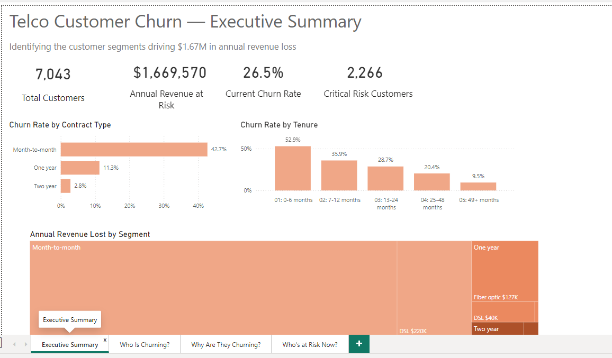
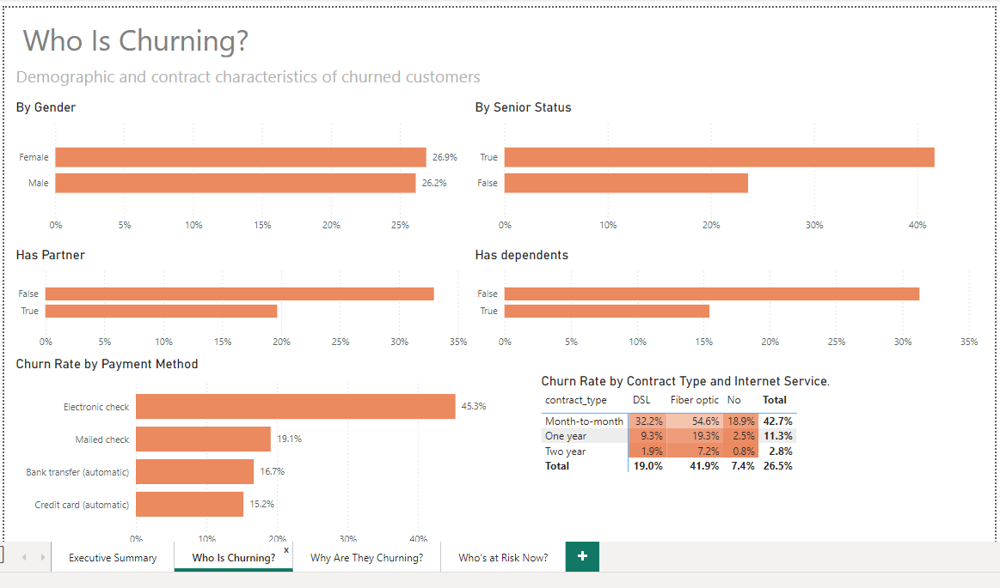
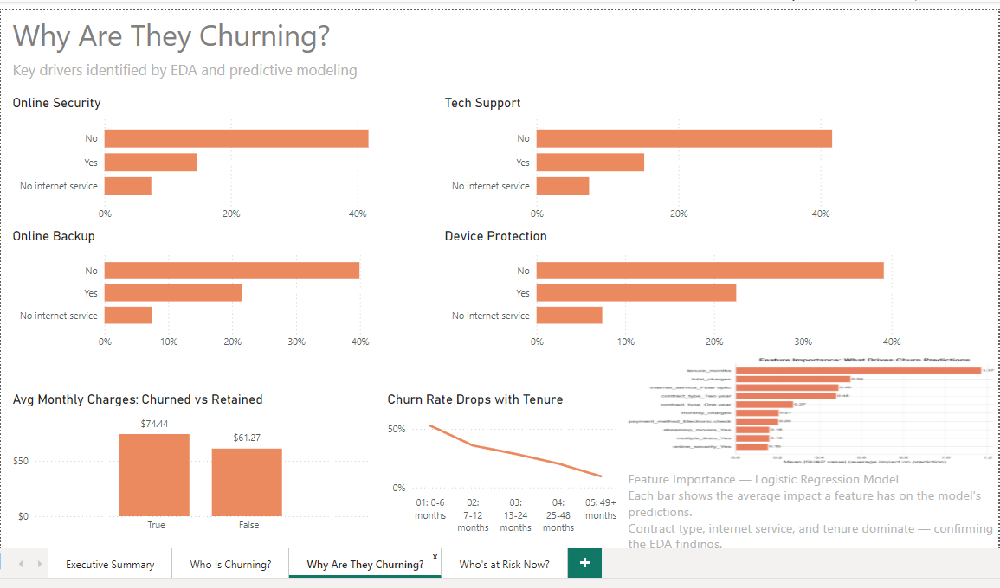
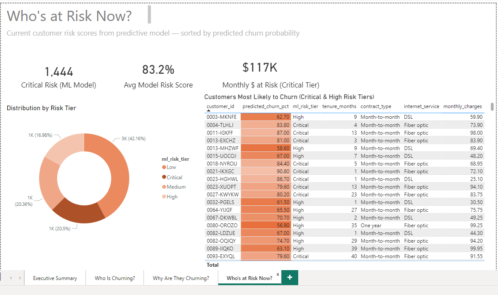

# Customer Churn Analysis

End-to-end analysis of subscription customer churn using SQL, Python, and Power BI. 
This project identifies the key drivers of customer attrition, builds a predictive model 
to flag at-risk customers, and quantifies the projected revenue impact of retention 
interventions.

## Business Problem

For subscription businesses, customer churn directly erodes recurring revenue. 
Acquiring a new customer typically costs 5–7x more than retaining an existing one. 
This project answers three questions:

1. **Who** is most likely to churn?
2. **Why** are they churning?
3. **What** can the business do about it, and what's the ROI?

## Tech Stack

- **PostgreSQL 16** — data modeling, SQL analysis
- **Python 3.11** — pandas, scikit-learn, XGBoost, SHAP
- **Power BI Desktop** — executive dashboard

## Project Structure
## Status

🚧 Work in progress — Phase 0 (environment setup) complete.

## Author

Jaswanthi A — [GitHub](https://github.com/Jaswanthi-A)

## Key Findings

- **One customer segment drives 72% of churn revenue.** Month-to-month customers with fiber internet — 30% of the customer base — account for $1.2M of the $1.67M annual revenue lost to churn.
- **Churned customers pay 21% more on average** ($74.44 vs $61.27/month). The company is losing its highest-value customers.
- **53% of all churn happens in the first 6 months** — pointing to an onboarding gap.
- **Month-to-month customers churn at 15x the rate** of two-year contract customers (42.7% vs 2.8%), making contract conversion the highest-leverage intervention.

## Recommendation Hypothesis

A targeted retention program focused on the ~2,100 month-to-month fiber customers — offering meaningful incentives to convert to annual contracts — could address the majority of the company's churn problem with far less spend than broad retention campaigns.

- **One contract type drives 87% of churn revenue.** Month-to-month customers — 55% of the base — account for $1.45M of the $1.67M lost annually. Two-year contract customers account for just 3% of churn revenue.
- **Within month-to-month, fiber customers are the worst segment.** This single sub-segment (30% of base) drives 72% of total churn revenue.
- **Churn front-loads in the customer lifecycle:** 53% of churn happens in the first 6 months.
- **Churned customers pay 21% more on average** ($74.44 vs $61.27) — the company is losing its highest-value customers.
- **A rules-based SQL scorecard already separates churners 29x.** Without any machine learning, 5 CASE WHEN risk factors produce a Critical tier with 57.4% actual churn vs 2.0% in the Low tier. The 2,266 customers flagged Critical represent $1.2M in annual revenue at risk — establishing the baseline that any ML model must beat.
- **A simple logistic regression beats more complex models** (ROC-AUC 0.839 vs XGBoost 0.831 vs Random Forest 0.821). The relationship between features and churn is largely linear and additive — interpretability and operational simplicity favor the simpler model. Recall on churners reaches 80%, meaning a retention program acting on these flags would address ~80% of at-risk customers.
- **The optimal classification threshold for the retention program is 0.50, generating $55K in net business value on the held-out test set.** Scaled to the full customer base, this represents approximately $275K annually — roughly 17% recovery of the $1.67M churn loss. The threshold sensitivity curve also shows the retention team has flexibility: any threshold between 0.20 and 0.55 produces similar net value, giving operational latitude.

## 📊 Live Interactive Dashboard

🔗 **[View the live Power BI dashboard](https://app.powerbi.com/view?r=eyJrIjoiYWJlMDYwNmEtNzdkNS00ODc1LWE5MjMtMjhhZTUxYWI2YTU2IiwidCI6IjcwZGUxOTkyLTA3YzYtNDgwZi1hMzE4LWExYWZjYmEwMzk4MyIsImMiOjN9
)**

A 4-page interactive dashboard built on top of the live PostgreSQL database 
and ML predictions:

- **Executive Summary** — headline KPIs and segment-level churn drivers
- **Who Is Churning?** — demographic and contract characteristics  
- **Why Are They Churning?** — service add-on impact, charges, tenure trends, SHAP feature importance
- **Who's at Risk Now?** — heat-mapped action list of 1,444 critical-risk customers
## Dashboard Pages

### Page 1: Executive Summary

### Page 2: Who Is Churning?

### Page 3: Why Are They Churning?

### Page 4: Who's at Risk Now?

## 📄 Case Study

📥 **[Read the full case study (PDF)](reports/case_study.pdf)** | 📝 **[View as Markdown](reports/case_study.md)**

A 2-3 page McKinsey-style memo summarizing the business problem, key findings, 
recommendations, and projected $275K annual impact.